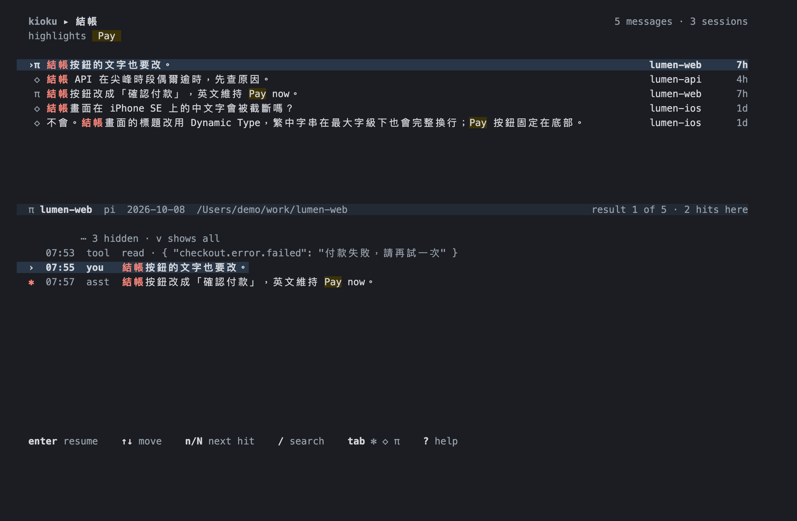

# kioku

<sub><i>kioku</i> (記憶) is Japanese for "memory".</sub>

**Search every Claude Code, Codex, Pi, Grok, OpenCode and Cursor CLI session on macOS or Linux, down to the message, in English, Chinese, Japanese and Korean.**

<p align="center">
  
</p>

- **Message-level hits.** Every row is the message that matched, ranked by BM25, with an agent mark, project and age.
- **Real CJK search.** [fts5-cjk](https://github.com/Ray0907/fts5-cjk) is compiled in, so `結帳`, `ログイン` and `결제` match inside running text.
- **Read the context, then continue.** The transcript folds unrelated turns into `⋯`. `enter` resumes the session in its own directory with `claude --resume`, `codex resume`, `pi --session` or `opencode --session`. Grok shows only `cd <cwd>` (Enter exits and prints it); no resume flag is assumed. `o` opens the project in your editor.
- **Local and read-only.** It never edits agent transcripts or checkpoints their databases. The only application data it writes is its own index in `~/.cache/kioku`.

<p align="center">
  
</p>

<sub>The demo and screenshots show the real TUI running on a synthetic demo home (<code>demo/make_demo_home.py</code>, regenerated by <code>demo/record.sh</code> and <code>demo/screenshot.sh</code>). Every project and conversation in them is invented.</sub>

Supports macOS 12+ and Linux (arm64 and amd64).

## Install

### Download (macOS)

Grab the archive for your Mac from [Releases](https://github.com/Ray0907/kioku/releases/latest): `darwin_arm64` for Apple Silicon, `darwin_amd64` for Intel.

```sh
arch=$(uname -m | sed 's/x86_64/amd64/')
curl -fsSLO "https://github.com/Ray0907/kioku/releases/latest/download/SHA256SUMS"
file=$(grep "darwin_${arch}" SHA256SUMS | awk '{print $2}')
curl -fsSLO "https://github.com/Ray0907/kioku/releases/latest/download/${file}"
shasum -a 256 -c SHA256SUMS --ignore-missing
tar -xzf "$file" kioku && sudo mv kioku /usr/local/bin/
```

The binary is not notarized. Downloaded with `curl` it runs as is; if you downloaded it in a browser and macOS blocks it, run `xattr -d com.apple.quarantine /usr/local/bin/kioku`.

### Download (Linux)

Grab `linux_arm64` or `linux_amd64` from [Releases](https://github.com/Ray0907/kioku/releases/latest):

```sh
arch=$(uname -m | sed 's/x86_64/amd64/;s/aarch64/arm64/')
curl -fsSLO "https://github.com/Ray0907/kioku/releases/latest/download/SHA256SUMS"
file=$(grep "linux_${arch}" SHA256SUMS | awk '{print $2}')
curl -fsSLO "https://github.com/Ray0907/kioku/releases/latest/download/${file}"
sha256sum -c SHA256SUMS --ignore-missing
tar -xzf "$file" kioku && sudo mv kioku /usr/local/bin/
```

### From source

Requires Go 1.26+ and a C compiler (Xcode Command Line Tools on macOS; GCC and libc development headers on Linux, e.g. `build-essential` on Debian/Ubuntu).

```sh
go install -tags sqlite_fts5 github.com/Ray0907/kioku@latest
# or, from a checkout:
make build
```

The `sqlite_fts5` build tag is required. `make install` puts the binary in `$(go env GOBIN)`, or `~/go/bin` when unset; make sure that directory is on your `PATH`.

If the macOS link step fails with `unknown architecture` from a `.tbd` file, your default SDK is newer than the linker. `make` already pins the macOS 26 SDK when it is installed; with `go install`, set `SDKROOT=/Library/Developer/CommandLineTools/SDKs/MacOSX26.sdk` yourself.

### Check and update

```sh
kioku --version
```

To update, repeat the install method you used. The index in `~/.cache/kioku` is reused; `kioku index --rebuild` rebuilds it if a release says it must.

## Use

```sh
kioku                    # recent sessions
kioku 紅茶                # interactive search
kioku --json snapshot    # compact JSON page for scripts/agents
kioku --harness pi 魚池   # restrict to one agent
kioku index              # sync and print counts
kioku index --rebuild    # replace the index
```

When stdout is not a TTY, search prints a compact text page; `--json` prints a structured JSON page. `--version` prints the version; `--no-mouse` disables mouse input. The initial scan runs on first use; the TUI opens with its existing index and refreshes when the scan finishes.

Search: space means AND; `"black tea"` is an exact phrase; `-word` excludes; bare words are prefixes (`resum` finds `resuming`); use `kioku -- --help` to search a flag-like word. CJK terms match inside text, including single characters. Empty or negative-only queries show the latest message of each recent session. The TUI shows up to 300 results by default; one-shot text and JSON pages show 10 (`--limit N` changes either): selective queries use FTS5 BM25 (newest first on ties); queries whose positive ASCII terms and full FTS match both cover at least 90% use newest matching message time instead. Matching user/assistant messages appear before tool output, with the existing order preserved within each group. Only a single unquoted 1–2 letter Latin prefix is restricted to messages from the seven days before the index's latest timestamp; when older matches are omitted, text pages end with `N older matches omitted (--all-time)` and JSON includes `omitted_older` (a message count, including in `--sessions`). Use `--all-time` to remove this restriction.

Kioku tool calls and their results are hidden from search by default; `--include-self` restores them for that run (including `--sessions`), without reindexing. User/assistant mentions remain searchable.

## For agents

```sh
kioku --limit 5 snapshot                  # short refs + snippets, at most 5 hits
kioku -p kioku --limit 5 snapshot        # exact project basename, case-insensitive; repeat -p for more
kioku --limit 5 --cursor TOKEN snapshot   # next page, same query and flags
kioku --sessions --limit 5 snapshot       # conversation-bearing sessions first; per-role hit counts
kioku show a1b2c3d4e5f6:12 --query "snapshot" --context 3  # center the hit, with surrounding messages
kioku show a1b2c3d4e5f6:12 --full         # entire marked message; context remains compact
kioku show a1b2c3d4e5f6 --context 0 --all    # walk the entire session, 10 messages/page
kioku --json --limit 5 snapshot          # one JSON object with hits and next_cursor
```

Replace the example ref and token with values from your output. Refs are stable short hashes of the source-qualified session ID plus the message index; `show` also accepts an unambiguous native session ID. Search snippets use at most 160 display cells; `show` text uses at most 400 unless `--full` is used for the marked hit (JSON then includes its original full text). The hit header and JSON `total_sessions` count distinct sessions across **all** matches. The copyable `expand:` command passes the search query to `show`, which centers the marked message around its first visible match; without `--query`, `show` starts at the beginning of the text. Session results include a directly showable `best_ref`, per-role counts (`roles.you`, `roles.asst`, `roles.tool` in JSON), and a 70-cell topic from the first real user message. `show` repeats that topic in its header and JSON. Sessions with conversation hits precede tool-only sessions; BM25 order remains within each tier. Show headers and JSON `start`, `end`, and `hit_index` use the same zero-based message indices as refs; `session_total` is the message count. A `cursor:` footer (or JSON `next_cursor`) appears only when more results exist; reuse it with the same mode, query, and flags. `show --all` starts at the first message and pages through the full session. JSON mirrors the text fields without full transcripts; use `show` to expand a result. Cursors use offsets against the current index, so a simultaneous reindex can shift later pages.

| Key | Action |
| --- | --- |
| typing | search (30 ms debounce) |
| ↓ / Esc | search → results |
| ↑↓ / j k | select message; ↑ on first row returns to search |
| / | focus search |
| n / N | next / previous hit in transcript |
| h / H | add a highlight / clear highlights |
| v | toggle full transcript |
| o | open project in editor |
| y | copy resume command |
| Enter | resume selected session in its original directory |
| Tab / Shift-Tab | cycle all / claude / codex / pi / grok / opencode / cursor |
| ? | help |
| Ctrl-C / Esc in results | quit |

Mouse clicks select/focus rows, click a highlighter tag to remove it, and wheel scrolls. Colors follow terminal background; `KIOKU_THEME=light|dark` overrides detection.

Editor resolution: `KIOKU_EDITOR`, then `VISUAL`, then the first available `zed`, `cursor`, `code`, `subl`, then supported macOS apps/Finder or `xdg-open` on Linux (install `xdg-utils`). Clipboard uses `pbcopy` on macOS; on Linux it tries `wl-copy` in a Wayland session, then `xclip`, then `xsel`. Install `wl-clipboard` for Wayland or `xclip`/`xsel` for X11. OSC 52 is always emitted as well, supporting remote terminals that allow it.

## macOS app (round 1)

[app/Kioku.xcodeproj](app/Kioku.xcodeproj) is a two-pane, keyboard-first AppKit reader.
Build with Xcode 26 / the macOS 26 SDK; deployment target is macOS 14.
It bundles the Go CLI and uses its JSON API—no SQLite or query parser in Swift.
Search, agent/project filters, conversation previews, Resume, copy-command and
Finder-style terminal/editor Open With menus are native controls.
See [app/README.md](app/README.md) for building, E2E, limits and verification blockers.

JSON now additionally exposes `show.resume_argv` alongside the original `cwd`
and `resume_cmd`. Native clients launch structured arguments instead of parsing
shell text. Search/session snippets and show messages can include `highlights`
(`location`/`length` in UTF-16 code units, using the existing TUI display matcher);
show messages include `matches` from the Go FTS predicate so clients can fold
unrelated turns without interpreting the query.

## Data and privacy

**Local-only and read-only:** transcript stores are never changed or uploaded. The only persistent writes are the search index under `$XDG_CACHE_HOME/kioku/index.db` (or `~/.cache/kioku/index.db`). Override it with `KIOKU_INDEX`. Source roots are selected independently, in this order (first nonempty value wins):

| Harness | kioku override | Native config dir | Default |
| --- | --- | --- | --- |
| Claude Code | `KIOKU_CLAUDE_DIR` | `$CLAUDE_CONFIG_DIR/projects` | `~/.claude/projects` |
| Codex | `KIOKU_CODEX_DIR` | `$CODEX_HOME/sessions` | `~/.codex/sessions` |
| Pi | `KIOKU_PI_DIR` | `$PI_CODING_AGENT_DIR/sessions` | `~/.pi/agent/sessions` |
| Grok | `KIOKU_GROK_DIR` | — | `~/.grok/sessions` |
| OpenCode | `KIOKU_OPENCODE_DB` | `$XDG_DATA_HOME/opencode/opencode.db` | `~/.local/share/opencode/opencode.db` |
| Cursor CLI | `KIOKU_CURSOR_DIR` | — | `~/.cursor/chats` |

Empty variables count as unset; a `~/` prefix expands to `$HOME`. kioku overrides point directly at the transcript root; native variables point at the parent config directory. A missing explicit root indexes nothing for that harness, without falling back to the default. Grok sessions are directories containing `chat_history.jsonl` and optional `summary.json`; metadata comes from the summary, with cwd/native ID falling back to the URL-decoded parent/session directory names. Only the history file is tracked for incremental appends. Use `--harness grok` to filter them. OpenCode's override points to the SQLite database, not a directory; both v1 and v2 sessions are read in read-only mode, including live WAL messages. SQLite may update transient `-shm` reader/WAL-index coordination fields; DB/WAL data is never written or checkpointed. If loading fails, cached OpenCode sessions are retained while other harnesses continue syncing. V2 takes precedence for duplicate IDs; subagent sessions and reasoning are skipped. Changed sessions are replaced using session/message timestamps rather than file appends. Use `--harness opencode` to filter them; resume runs `opencode --session <id>` from the session's directory. Set `KIOKU_DEBUG_TIMING=1` for startup/sync/query/snippet/render timings on stderr.

Cursor CLI sessions are `~/.cursor/chats/<md5(cwd)>/<session-id>/{meta.json,store.db}`. Only JSON user/assistant message blobs are read, in rowid order (an approximation: the store has no recorded message order). Binary graph nodes and Cursor IDE `state.vscdb` stores are ignored; sessions without a metadata cwd are skipped. Session start uses metadata `createdAtMs`; messages use `store.db` mtime because they have no timestamps. Changes to either file's mtime/size replace the whole session. Use `--harness cursor`; resume runs `cursor-agent --resume <id>` from the session's directory.

Search tokenization uses [fts5-cjk](https://github.com/Ray0907/fts5-cjk), statically linked under its original license in `internal/cjk/`.

## Agent skill

`skills/kioku/SKILL.md` teaches coding agents to reach for kioku whenever you mention earlier work ("last time we…", "where did I…", 之前、上次). With it, they search wide to narrow instead of grepping raw transcripts: `--sessions`, then hits, then `show`, paging with `--cursor`. Install it once:

```sh
git clone https://github.com/Ray0907/kioku && cd kioku
mkdir -p ~/.claude/skills/kioku ~/.agents/skills/kioku
cp skills/kioku/SKILL.md ~/.claude/skills/kioku/   # Claude Code
cp skills/kioku/SKILL.md ~/.agents/skills/kioku/   # Codex, Pi and other agents that read ~/.agents/skills
```

The `kioku` binary must be on your `PATH`.

## License

MIT. Bundles [fts5-cjk](https://github.com/Ray0907/fts5-cjk) (MIT) and SQLite headers (public domain).
